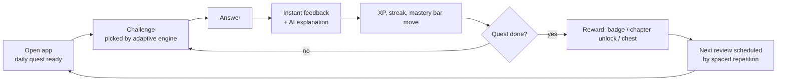
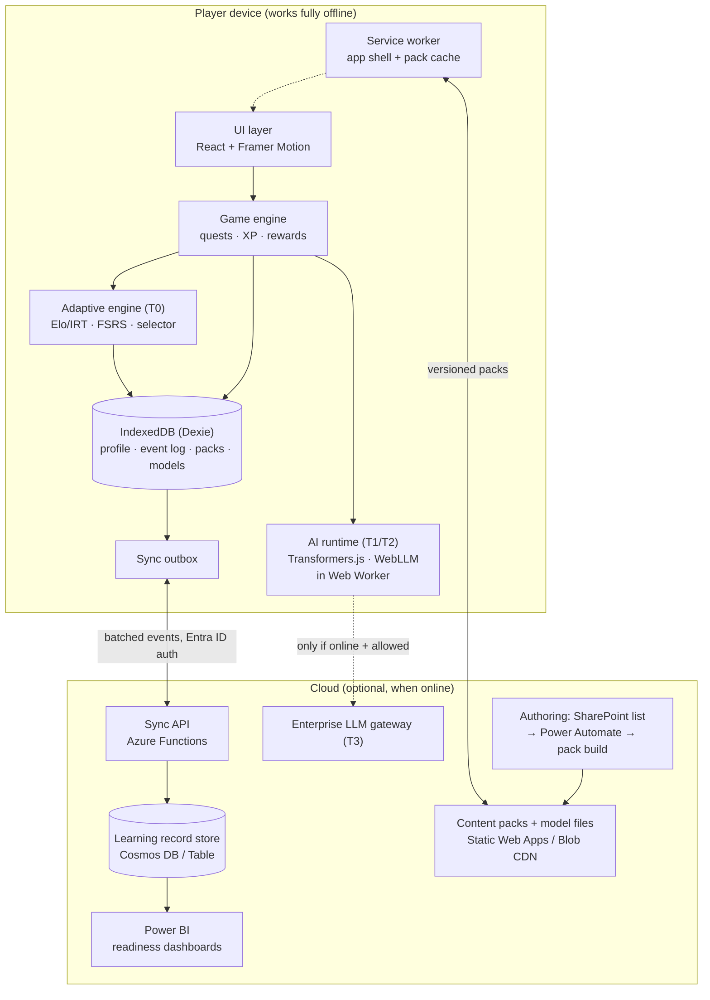

# Skill Quest — Offline AI Learning Game: Plan & Design

| | |
|---|---|
| **Status** | Design proposal (v1.0) |
| **Date** | 6 Oct 2026 |
| **Scope** | Product concept, architecture, AI design, gamification, governance, delivery plan |
| **Reuses** | The stack already proven in `app/` (React + Vite + PWA + service worker + JSON content validated by tests) |

---

## 1. Executive summary

Skill Quest is a mobile-first learning game that **works fully offline** and uses **AI that runs on the device** to adapt every session to the player. Players complete 5-minute quests, scenario simulations and "boss battles"; the game learns what each player knows and what they keep forgetting, and serves the right challenge at the right time.

- **Offline by design, not by accident.** Everything needed to play, score and adapt lives on the phone. The network is used only to sync progress and download new content packs.
- **The AI is layered.** A small, explainable adaptive engine (no large model) runs on every device. Richer AI feedback (free-text grading, a coaching chat) switches on only where the device can handle it, and cloud AI is an optional extra, never a dependency.
- **"The engine decides, the AI explains."** Scores and progression come from deterministic, testable rules. Generative AI writes feedback and hints but never awards points by itself. This keeps results fair, auditable and safe.
- **Content is data.** Topics ship as versioned content packs (JSON) validated in CI, so new subjects (AI literacy, Copilot skills, security awareness, onboarding) need no code changes.
- **Recommended route:** an installable web app (PWA) built on the existing `app/` stack. MVP in ~8 weeks with a team of 4; on-device generative AI follows in a second phase.

**First content pack (proposed):** *Responsible AI & Copilot Essentials* for SEA staff — it doubles as an AI-adoption lever and a governance-training tool. The engine is topic-agnostic.

---

## 2. Problem statement and success criteria

**Problem (one line):** Mandatory and self-paced digital training has low completion and poor retention because it is one-size-fits-all, online-only and dull.

**Business impact:** Staff on the move, in branches, on sites or with patchy connectivity can't train when they have time; generic courses waste time on what people already know; low retention shows up later as support tickets, risky AI use and slow tool adoption.

| Success measure | Baseline (assumed) | Target at 6 months |
|---|---|---|
| Weekly active learners / invited | n/a | ≥ 45% |
| Module completion rate | ~30% (typical e-learning) | ≥ 70% |
| Knowledge retention at 30 days (re-test score) | n/a | ≥ 80% |
| Median time to mastery per skill vs linear course | 100% | ≤ 60% |
| Sessions started offline | n/a | Tracked; must be fault-free (0 data-loss incidents) |
| Learner satisfaction (in-app, 1–5) | n/a | ≥ 4.2 |

---

## 3. Product concept

### 3.1 Players

| Persona | Need | Design response |
|---|---|---|
| **Field / branch staff** | Learn in short gaps, often offline | 5-minute quests, offline-first, small download |
| **Office knowledge worker** | Apply AI and Copilot safely at work | Scenario sims built from real workflows |
| **Team lead** | See team readiness, encourage without nagging | Team league, readiness dashboard (aggregated) |
| **Content owner / L&D** | Publish and update quickly | Content packs authored in a SharePoint list or JSON, auto-validated |
| **Governance / compliance** | Evidence of training, fair scoring | Immutable learning-event log, xAPI export, deterministic scoring |

### 3.2 Core loop



### 3.3 Game modes

| Mode | Length | What it is | AI role |
|---|---|---|---|
| **Daily Quest** | 3–5 min | 5–8 mixed challenges tuned to the player | Picks items, schedules reviews |
| **Scenario Sim** | 5–10 min | Branching story: "A colleague pastes client data into a public chatbot — what do you do?" | Adapts branch difficulty; explains consequences |
| **Prompt Dojo** | 5 min | Player writes a prompt or short answer; graded against a rubric | Grades free text (on-device), coaches improvements |
| **Boss Battle** | 10 min | End-of-chapter mixed test under light time pressure | Generates variants so it can't be memorised |
| **Review Run** | 2 min | Only items the player is about to forget | Spaced-repetition scheduler |
| **Team League** (online) | Weekly | Team XP vs other teams, cooperative goals | None; social layer only |

### 3.4 Challenge types (content building blocks)

Multiple choice · multi-select · order the steps · match pairs · spot the risk (tap the problem in a mock screen) · true/false with justification · free-text / prompt writing · branching scenario node · drag-to-classify (e.g. *Public / Internal / Confidential*).

---

## 4. Gamification design

Gamification exists to drive **learning behaviour**, not screen time. Every mechanic below maps to a behaviour we want.

| Mechanic | Behaviour it drives | Design rules (anti-dark-pattern) |
|---|---|---|
| **XP & levels** | Showing up, completing | XP weighted by *difficulty and mastery gain*, not by speed-clicking |
| **Streaks** | Habit | 2 free "streak shields" per week; weekends optional; no guilt notifications |
| **Mastery map** | Seeing real progress | Skill tree coloured by actual mastery (from the engine), not by "completed" |
| **Badges** | Exploration, milestones | Earned for meaningful acts ("Fixed 10 risky prompts"), never for logging in alone |
| **Story chapters** | Curiosity, narrative pull | Chapters unlock by mastery; a recurring cast set in a fictional SEA company |
| **Loot chests** | Delight | Cosmetic only (avatar items, themes). No randomised rewards that affect scores |
| **Boss battles** | Consolidation | Pass = chapter certified; fail = targeted review, not a penalty |
| **Combo / perfect run** | Focus | Small XP bonus; resets silently |
| **Team league** | Social motivation | Teams, not individuals, are ranked publicly; individual boards opt-in only |
| **Daily challenge** | Variety | Same challenge for everyone that day — great for team chat ("did you get it?") |
| **"Why this question?"** | Trust in the AI | One tap shows the engine's reason: *"You missed this 3 days ago."* |

**Difficulty in the "flow zone":** the engine targets a 70–85% predicted success rate per item — hard enough to learn, easy enough to keep going.

**Reward schedule:** small, frequent, predictable rewards (XP per answer), medium milestone rewards (badge per skill mastered), rare big moments (chapter unlock, boss cleared, with animation and sound — reuse the motion style from `app/`).

---

## 5. AI design ("AI learning")

"AI learning" works in two directions: **the game learns the player** (adaptive engine), and **the player learns with AI** (feedback, coaching, and AI-literacy content). The design is tiered so the app always works, on any device, offline.

### 5.1 AI capability tiers

| Tier | Runs on | Size | Capability | Availability |
|---|---|---|---|---|
| **T0 – Adaptive engine** | Every device, pure TypeScript | < 30 KB | Skill tracking, item selection, spaced repetition, difficulty tuning | Always, offline |
| **T1 – Small NLP models** | Device CPU / WASM (Transformers.js / ONNX Runtime Web) | ~30–120 MB, opt-in download | Grade free-text answers by meaning (multilingual embeddings), classify prompts for risk | Offline after download |
| **T2 – On-device small LLM** | Device GPU via WebGPU (e.g. WebLLM with a 1–3B quantised model) | ~1–2 GB, opt-in, Wi-Fi only | Coaching chat, personalised hints, rewrite-my-prompt feedback | Offline after download, capable devices only |
| **T3 – Cloud LLM** | Approved enterprise endpoint (e.g. Azure OpenAI or Claude via the company gateway) | 0 MB | Richest feedback, content-variant generation | Online + policy allows |

The app detects capability at start-up (storage quota, WebGPU, memory) and picks the highest permitted tier, falling back silently. **Every feature has a T0 fallback** (e.g. free-text grading falls back to keyword rubric; coaching falls back to authored hints).

### 5.2 The adaptive engine (T0) — the core

Three small, well-understood algorithms. No black box.

1. **Skill model — Elo / 1-parameter IRT per skill.**
   Each skill has a player ability θ; each item has difficulty *b*.
   `P(correct) = 1 / (1 + e^-(θ − b))`
   After an answer: `θ ← θ + K · (outcome − P)`, with K shrinking as evidence grows. Item difficulties are seeded by authors and re-calibrated from aggregated (anonymised) data when online.

2. **Memory model — FSRS spaced repetition.**
   Each item the player has seen carries stability and difficulty; the scheduler computes when recall probability drops below 90% and queues a review.

3. **Item selector — weighted scoring.**
   ```
   score(item) = w1 · closeness(P(correct), 0.78)     // flow zone
               + w2 · reviewDue(item)                  // forgetting curve
               + w3 · skillPriority(skill)             // curriculum / mandatory topics
               + w4 · novelty(item)                    // avoid repeats in session
               − w5 · fatigue(session)                 // ease off after mistakes
   ```
   Top-scoring item is served; the winning reason is stored for "Why this question?".

The engine is deterministic given a seed, so it is unit-testable and can be tuned with **simulated learners** (thousands of synthetic players run in CI to check that mastery rises and frustration — streaks of failures — stays low).

### 5.3 Generative AI guardrails (T2/T3)

- **The engine decides, the AI explains.** Points, mastery and certification come only from T0/T1 scoring. LLM output is advisory text.
- **Grounded prompts.** The model receives the item, the rubric and the player's answer — never other players' data — and must answer in a fixed JSON schema (`verdict_hint`, `explanation`, `next_tip`). Invalid output → authored fallback text.
- **Clearly labelled.** All AI-written text carries an "AI feedback" tag and a 👍/👎 control; flagged responses are queued for content-owner review when online.
- **Content filters** on both input and output (blocked-topic list, PII patterns) applied on device.
- **No training on player data** on device or in the cloud tier. Aggregated, anonymised stats are used only to re-calibrate item difficulty.

---

## 6. Solution options

| Option | Benefits | Risks | Cost / Effort | Recommendation |
|---|---|---|---|---|
| **A. PWA (React + Vite), reusing `app/` stack** | One codebase for iOS, Android, desktop; installable; offline proven in this repo; deploys to Azure Static Web Apps or SharePoint; WebGPU path for on-device LLM | iOS storage limits and eviction; WebGPU uneven on older phones; no app-store presence | **Low–Medium** | ✅ **Recommended** |
| B. Native (Flutter / React Native) | Best performance, native AI runtimes (Core ML, NNAPI), reliable storage | Two store pipelines, MDM packaging, longer release cycles | Medium–High | Revisit if T2 on-device LLM becomes a must-have on low-end phones |
| C. Power Apps (canvas, offline) | Microsoft-native, fast for forms, Dataverse built in | Weak for games/animation; limited offline; no on-device AI; per-user licence cost | Low build, ongoing licence | ❌ Use Power Platform for the *back office* (content approvals, reporting), not the game |
| D. Buy an LMS gamification add-on | Fast start | Usually online-only, generic, no adaptive AI, data residency questions | Licence | ❌ Doesn't meet the offline + adaptive requirement |

**Why A:** it maximises reuse (same toolchain, CI, deployment and content-validation pattern as `app/`), keeps cost low, and leaves a clean upgrade path to native wrappers (Capacitor) if store distribution is ever required.

---

## 7. Architecture

### 7.1 High-level view



### 7.2 Key components

| Component | Responsibility | Tech |
|---|---|---|
| **App shell** | Screens, navigation, animation, sound | React 19, Framer Motion, CSS (as in `app/`) |
| **Game engine** | Quest runner, scoring, XP, streaks, rewards, story unlocks | Pure TS, event-driven (reuse the `engine/bus.ts` + `runner.ts` pattern) |
| **Adaptive engine** | Skill state, item selection, review scheduling | Pure TS, seeded RNG, 100% unit-tested |
| **AI runtime** | Load/run T1/T2 models off the main thread; capability detection | Web Worker, Transformers.js, WebLLM |
| **Storage** | Profile, event log, content packs, model blobs | IndexedDB via Dexie; `navigator.storage.persist()` requested |
| **Offline layer** | Cache shell and packs; background update | Service worker (Workbox or the hand-rolled pattern in `app/public/sw.js`) |
| **Sync** | Push events, pull packs and leaderboards | Outbox + Background Sync, retry with back-off |
| **Content pipeline** | Author → validate → version → publish packs | JSON Schema + validator test (same idea as `content/validate.ts`) |

### 7.3 Offline-first data and sync model

The single most important engineering decision: **store events, derive state.**

- Every action is an immutable, timestamped **learning event** (`answered`, `quest_completed`, `badge_earned`…), written to IndexedDB *before* the UI updates.
- Player state (XP, mastery, streaks) is a **projection** recomputed from events, with periodic snapshots for speed.
- Sync = upload events not yet acknowledged, download events from other devices. Because events are append-only with unique IDs, merging is a **set union** — no conflicts, no lost progress, works across phone + laptop.
- Events map 1:1 to **xAPI statements**, so the record store can feed any LMS or Power BI.

```ts
// Core types (illustrative)
type LearningEvent = {
  id: string;            // ULID: sortable, unique per device
  playerId: string;
  deviceId: string;
  at: string;            // ISO timestamp (device clock; server stamps receipt time)
  type: 'answered' | 'quest_started' | 'quest_completed' | 'badge_earned' | 'hint_used' | 'ai_feedback_rated';
  itemId?: string;
  skillId?: string;
  outcome?: number;      // 0..1, from deterministic scorer
  ms?: number;           // response time
  packVersion: string;
  engineVersion: string;
};

type SkillState = { skillId: string; theta: number; evidence: number; updatedAt: string };
type ReviewCard  = { itemId: string; stability: number; difficulty: number; dueAt: string };

type ContentPack = {
  id: string; version: string; locale: string;
  skills: { id: string; name: string; prerequisites: string[]; mandatory?: boolean }[];
  items: Item[];          // challenge definitions with difficulty b, rubric, hints, explanation
  story: Chapter[];
  badges: BadgeRule[];
};
```

### 7.4 Storage and size budgets

| Asset | Budget | Notes |
|---|---|---|
| App shell (JS + CSS, gzipped) | ≤ 300 KB | First load < 2 s on 4G |
| Content pack (per topic, with images as WebP/SVG) | ≤ 5 MB | Delta updates by pack version |
| T1 models | ≤ 120 MB | Opt-in, Wi-Fi only, cached |
| T2 model | ≤ 2 GB | Opt-in, capable devices only, clear storage warning |
| Event log | ~1 KB/event | Compacted into snapshots after successful sync |

### 7.5 Security and identity

- **Sign-in:** Microsoft Entra ID (MSAL) on first run while online; token cached; play works offline with the cached identity. Guest mode for kiosks/events, with no sync.
- **Data at rest:** IndexedDB holds only the player's own learning data — no customer or business data. Optional encryption of the profile using a key from WebCrypto.
- **Integrity:** offline play can be tampered with on a rooted device. Mitigation: server-side plausibility checks on synced events (impossible speed, impossible score sequences); **certifications only granted from an online Boss Battle** with server-issued item variants. Leaderboards are for fun; certificates are for compliance.
- **Transport:** HTTPS only, Content Security Policy, signed content-pack manifests (hash check before activation).

---

## 8. Governance, privacy and responsible AI

| Area | Control |
|---|---|
| **Privacy (PDPA SG/MY/TH, PDP Law ID, Decree 13 VN)** | Data minimisation: learning events only; on-device processing by default; data residency in an approved Azure region; retention policy (e.g. 24 months) with deletion on exit |
| **Transparency** | "Why this question?" explanations; AI-generated text labelled; a plain-language model card in Settings |
| **Fairness** | Scoring deterministic and identical for all players; free-text grader evaluated per language before release (bias/accuracy test set) |
| **Human oversight** | Content owner approves every pack; flagged AI feedback reviewed weekly; no automated HR decisions from game data |
| **Wellbeing** | No individual public ranking by default; quiet hours for notifications; no penalties for missed days |
| **People analytics** | Manager dashboards show team-level aggregates (minimum group size, e.g. 5) — agree with HR and works councils before launch |
| **AI policy alignment** | Register the solution in the AI use-case inventory; DPIA before pilot; T3 cloud tier only via the approved enterprise gateway |

---

## 9. Localisation and accessibility

- **Languages:** EN first; then TH, VI, ID, MS, zh-Hans via per-locale content packs. UI strings via ICU message format.
- **Watch-out:** small on-device models are noticeably weaker in Thai and Vietnamese. T1 uses a multilingual embedding model; T2 coaching is enabled per language only after it passes the evaluation set.
- **Accessibility:** WCAG 2.2 AA; full keyboard and screen-reader support; reduced-motion respected (as `app/` already does); no colour-only signals; adjustable timers in Boss Battles.

---

## 10. Quality engineering

| Layer | What we test | How |
|---|---|---|
| Adaptive engine | Correctness, determinism, convergence | Unit tests + **simulated learner** suite (10k synthetic players) in CI |
| Content packs | Schema, broken references, answer keys, reading level | Validator test, fails CI with a clear message |
| Offline behaviour | Play, score and resume with network off; sync after reconnect; no data loss on kill | Playwright with network emulation (`context.setOffline(true)`) |
| Sync | Duplicate, out-of-order and partial uploads | Property-based tests on the merge logic |
| AI tiers | Fallback when model missing, slow or invalid output; per-language accuracy | Contract tests + golden-set evaluation |
| Performance | Load time, memory, battery on a mid-range Android | Lighthouse CI budgets + manual device lab |
| Accessibility | WCAG checks | axe-core in CI + manual screen-reader pass |

---

## 11. Delivery plan

### 11.1 Phases

| Phase | Duration | Scope | Exit criteria |
|---|---|---|---|
| **0. Discovery & content** | 2 weeks | Confirm audience and first pack; write 60–80 items + 1 story chapter; paper/clickable prototype; DPIA started | 10 users play the prototype; content owner signs off |
| **1. MVP (offline, T0 AI)** | 6 weeks | PWA shell, Daily Quest, Scenario Sim, adaptive engine, XP/streaks/badges/mastery map, IndexedDB event log, guest + Entra sign-in, pack pipeline | Plays fully offline; engine passes simulated-learner suite; pilot-ready |
| **2. Pilot** | 4 weeks | 1–2 SEA teams (~100 users); sync API; basic Power BI dashboard | KPI baselines captured; ≥ 4.0 satisfaction; zero data-loss incidents |
| **3. On-device AI (T1/T2)** | 6 weeks | Prompt Dojo with free-text grading; coaching chat on capable devices; AI feedback rating loop | Grader ≥ 85% agreement with human markers per language |
| **4. Social & scale** | 6 weeks | Team League, daily challenge, more languages, more packs, T3 cloud tier | Rollout to all SEA markets |

**Quick wins (first 2 weeks):** reuse the `app/` repo scaffolding, CI and deployment; ship a single offline Daily Quest with 20 items to a friendly team for feedback.

### 11.2 Team and effort

| Role | FTE | Phases |
|---|---|---|
| Tech lead / full-stack engineer | 1.0 | All |
| Front-end / game engineer | 1.0 | 1–4 |
| ML engineer (part-time) | 0.5 | 1 (engine tuning), 3 |
| UX / game designer | 0.5 | 0–2, 4 |
| Content designer / SME | 0.5 | 0–4 |
| Product owner (business) | 0.2 | All |

**Estimate:** MVP ≈ 8 weeks / ~25 person-weeks. Full roadmap to SEA scale ≈ 6 months / ~70 person-weeks. Run cost is low: static hosting + Functions + Cosmos serverless (typically tens to low hundreds of USD/month at SEA scale); T3 cloud AI is the only variable cost and is optional.

### 11.3 Proposed repo layout

```
skill-quest/
  src/
    app/          screens, navigation, theme
    game/         quest runner, scoring, rewards, story
    adaptive/     elo.ts, fsrs.ts, selector.ts, simulate.ts
    ai/           capability.ts, worker.ts, grader.ts, coach.ts, fallbacks.ts
    data/         db.ts (Dexie), events.ts, projections.ts, sync.ts
    content/      schema.ts, validate.ts, packs/
  public/         sw.js, manifest, icons
  test/           unit, simulation, offline e2e (Playwright)
```

---

## 12. Risks, assumptions and dependencies

### Risks

| Risk | Likelihood | Impact | Mitigation |
|---|---|---|---|
| iOS evicts offline storage | Medium | High | Request persistent storage; sync whenever online; event log is small and recoverable from server |
| On-device LLM too heavy for many phones | High | Medium | T2 is optional; T0/T1 deliver the core value; consider native wrapper later |
| Weak AI quality in SEA languages | Medium | Medium | Per-language evaluation gate; authored fallbacks |
| Gamification feels childish or creates pressure | Medium | Medium | Professional visual tone; opt-in leaderboards; user testing in Phase 0 |
| Content becomes stale | High | High | Named content owners; quarterly pack review; analytics flag items everyone fails/passes |
| Game data used for performance management | Low | High | Policy statement, aggregate-only dashboards, HR agreement before launch |
| Offline score tampering | Low | Low–Medium | Plausibility checks; certifications only online |

### Assumptions
- Players have a company or personal smartphone with a modern browser (Chrome/Edge/Safari from the last 2 years).
- Entra ID is available for sign-in; an approved Azure subscription exists.
- Training content experts can commit ~0.5 FTE.

### Dependencies
- InfoSec and Privacy approval (DPIA), AI governance registration.
- Enterprise LLM gateway access for T3 (Phase 4 only).
- HR / L&D agreement on how completion data is used and reported.

---

## 13. Decisions required

1. **Approve PWA (Option A)** as the delivery approach.
2. **Choose the first content pack** — recommended: *Responsible AI & Copilot Essentials*.
3. **Pick pilot teams** (1–2 SEA markets, ~100 users) and a business product owner.
4. **Confirm data policy:** game data for learning and aggregate readiness only, not individual performance reviews.

## 14. Recommended next actions

| Action | Owner | Due | Status |
|---|---|---|---|
| Review this design and confirm decisions in §13 | Sponsor / Senior Manager SEA IT | +1 week | Open |
| Nominate content owner and draft 60–80 items | L&D / SME | +2 weeks | Open |
| Start DPIA and AI use-case registration | Governance | +2 weeks | Open |
| Scaffold `skill-quest/` from the `app/` stack; build adaptive engine + simulated-learner tests | Engineering | +3 weeks | Open |
| Clickable prototype test with 10 users | UX | +2 weeks | Open |
